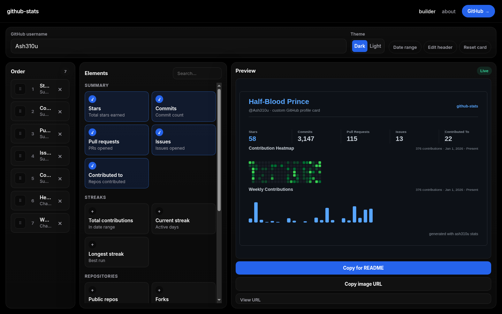
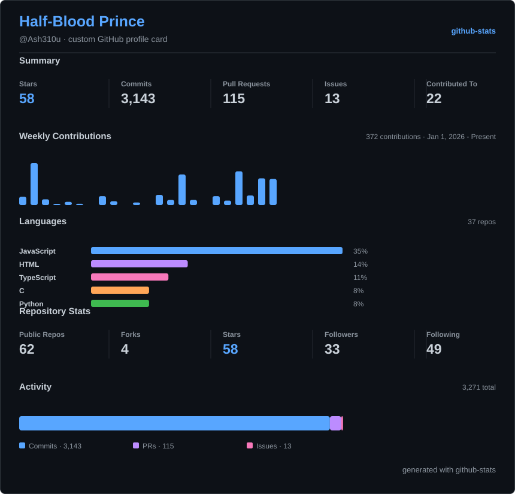

# GitHub Stats

A growing API for generating GitHub stats cards, contribution charts, and profile widgets for README profiles, websites, and dashboards.





## Use The API

Use the main stats card directly in Markdown:

```md

```

Use the contribution chart with the same clean default card design:

```md

```

More chart types:

```md


```

Use a dark GitHub-style theme:

```md

```

Build a custom card in the browser:

```text
https://api-github-readme-stats.vercel.app/
```

The builder is a single-screen dashboard. Pick individual stats and charts, drag to reorder them, edit the card header, and copy a Markdown snippet or image URL. Visit `/about` for project and creator details.

Or use the custom card endpoint directly:

```md

```

Customize the card header:

```md

```

Get raw JSON instead of an SVG:

```text
https://api-github-readme-stats.vercel.app/api/stats?username=Ash310u&format=json
https://api-github-readme-stats.vercel.app/api/stats/chart?username=Ash310u&format=json
https://api-github-readme-stats.vercel.app/api/stats/custom?username=Ash310u&elements=stars,commits,prs,issues,contributed,heatmap,weekly&format=json
```

## Endpoints

| Endpoint | Description |
| --- | --- |
| `/` | Browser builder for composing custom cards. |
| `/about` | About page with creator details and a link back to the builder. |
| `/api/stats` | Summary card with stars, commits, pull requests, issues, and repositories contributed to. |
| `/api/stats/custom` | One combined SVG card made from individually selected elements. |
| `/api/stats/chart` | Contribution metrics with total contributions, current streak, and longest streak. |
| `/api/stats/languages` | Horizontal bar chart of top programming languages by repository count. |
| `/api/stats/repos` | Repository-focused card with forks, stars, followers, and following. |
| `/api/stats/activity` | Stacked bar chart breaking down commits, pull requests, and issues. |
| `/api/stats/heatmap` | GitHub-style contribution heatmap grid for the selected date range. |
| `/api/stats/weekly` | Vertical bar chart of contributions grouped by week. |
| `/health` | Health check with available endpoint examples. |

## Settings

| Query | Required | Default | Values | Description |
| --- | --- | --- | --- | --- |
| `username` | Yes | none | Any GitHub username | The profile to show stats for. |
| `theme` | No | `github_light` | `github_light`, `github_dark`, `light`, `dark` | Changes the SVG colors. |
| `format` | No | `svg` | `svg`, `json` | Returns an image card or raw stats data. |
| `elements` | No | `stars,commits,prs,issues,contributed,heatmap,weekly` | See custom elements below | Comma-separated element list for `/api/stats/custom`. |
| `title` | No | empty | Up to 60 characters | Custom card title shown in the header. |
| `subtitle` | No | empty | Up to 60 characters | Custom subtitle shown below the title. |
| `badge` | No | `github-stats` | Up to 60 characters | Badge text shown in the top-right corner. |
| `widgets` | No | none | `stats`, `heatmap`, `weekly`, `chart`, `languages`, `repos`, `activity` | Legacy widget groups. Expands into `elements` when `elements` is omitted. |
| `from` | No | Jan 1 of the current year | `YYYY-MM-DD` | Start date for contribution-based cards (`chart`, `heatmap`, `weekly`). |
| `to` | No | Today | `YYYY-MM-DD` | End date for contribution-based cards (`chart`, `heatmap`, `weekly`). |

### Custom Elements

Use `elements` to pick individual stats and charts for `/api/stats/custom`:

| Element | Type | Description |
| --- | --- | --- |
| `stars` | metric | Total stars across public repositories. |
| `commits` | metric | Total commits authored by the user. |
| `prs` | metric | Total pull requests opened by the user. |
| `issues` | metric | Total issues opened by the user. |
| `contributed` | metric | Repositories contributed to. |
| `total_contributions` | metric | Total contributions in the selected date range. |
| `current_streak` | metric | Current contribution streak. |
| `longest_streak` | metric | Longest contribution streak. |
| `public_repos` | metric | Public repository count. |
| `forks` | metric | Total forks across public repositories. |
| `repo_stars` | metric | Total stars across public repositories. |
| `followers` | metric | Follower count. |
| `following` | metric | Following count. |
| `heatmap` | chart | GitHub-style contribution heatmap grid. |
| `weekly` | chart | Weekly contribution bar chart. |
| `languages` | chart | Top programming languages by repository count. |
| `activity` | chart | Stacked bar chart of commits, pull requests, and issues. |

Example:

```text
/api/stats/custom?username=Ash310u&theme=github_dark&elements=stars,prs,issues,heatmap
```

The card footer is fixed as `generated with ash310u stats` and is not customizable.

## Stats Shown

The summary card shows:

- Total stars across the user's public repositories.
- Total commits authored by the user.
- Total pull requests opened by the user.
- Total issues opened by the user.
- Repositories contributed to, counted from returned commit, pull request, and issue search results.

The contribution chart shows:

- Total contributions in the selected date range.
- Current contribution streak.
- Longest contribution streak.

The languages card shows:

- Top 5 programming languages ranked by public repository count.
- Percentage share for each language.

The repos card shows:

- Public repositories, total forks, and total stars.
- Average stars per repository, followers, and following.

The activity card shows:

- A stacked bar of commits, pull requests, and issues.
- Count and percentage for each activity type.

The heatmap card shows:

- A GitHub-style contribution grid for the selected date range.
- Total contributions and a less-to-more legend.

The weekly chart shows:

- A bar chart of contributions grouped by week.
- The most recent 26 weeks from the selected date range.

The custom card builder shows:

- A React dashboard at `/` with order, element picker, and live preview columns.
- Drag-and-drop reordering for selected elements.
- Optional card header text and a date range picker.
- A generated `/api/stats/custom` image URL and Markdown snippet for profile READMEs.
- An About page at `/about` with creator details and social links.

## GitHub Token

`GITHUB_TOKEN` is a GitHub personal access token used by the server when it calls the GitHub API.

The summary card can run without a token, but GitHub gives unauthenticated requests a much smaller rate limit. The contribution chart uses GitHub GraphQL, so it needs `GITHUB_TOKEN` for reliable chart data.

If you deploy this for other people to use, add `GITHUB_TOKEN` to your hosting provider's environment variables so the cards do not fail after a small number of requests.

Do not put the token in your README, browser URL, frontend code, or API query params. Keep it only in server environment variables.

For Vercel:

```text
Project Settings -> Environment Variables -> GITHUB_TOKEN
```

For local development, create a `.env` file or run:

```bash
GITHUB_TOKEN=your_token npm start
```

If a real token is ever shared publicly, revoke it in GitHub and create a new one.

## Project Structure

```text
src/
  config/          Environment and runtime config
  controllers/     Request handlers for API endpoints
  http/            Router and response helpers
  renderers/       Shared class-based SVG renderers for cards and charts
  services/        GitHub REST, GraphQL, and stats data logic
  utils/           Formatting and escaping helpers
  server.js        Node HTTP server entrypoint
public/
  app.js           Builder dashboard
  site.js          Navigation, About page, and footer
  styles.css       Shared site styles
```

## Run Locally

Install dependencies:

```bash
npm install
```

Start the server:

```bash
npm start
```

Start in watch mode:

```bash
npm run dev
```

The server starts on:

```text
http://localhost:3000
```

Try it locally:

```text
http://localhost:3000/
http://localhost:3000/about
http://localhost:3000/api/stats?username=Ash310u
http://localhost:3000/api/stats/chart?username=Ash310u
http://localhost:3000/api/stats/languages?username=Ash310u
http://localhost:3000/api/stats/repos?username=Ash310u
http://localhost:3000/api/stats/activity?username=Ash310u
http://localhost:3000/api/stats/heatmap?username=Ash310u
http://localhost:3000/api/stats/weekly?username=Ash310u
http://localhost:3000/api/stats/custom?username=Ash310u&elements=stars,commits,prs,issues,contributed,heatmap,weekly
```

If port `3000` is already busy, use another port:

```bash
PORT=3001 npm run dev
```

## Contributing

Contributions are welcome. You can help by improving card design, adding themes, adding more stat options, improving docs, or fixing API behavior.

Before opening a pull request:

1. Run the project locally.
2. Test the SVG endpoint and JSON endpoint.
3. Keep tokens and local secrets out of commits.
4. Update the README when adding or changing API options.
