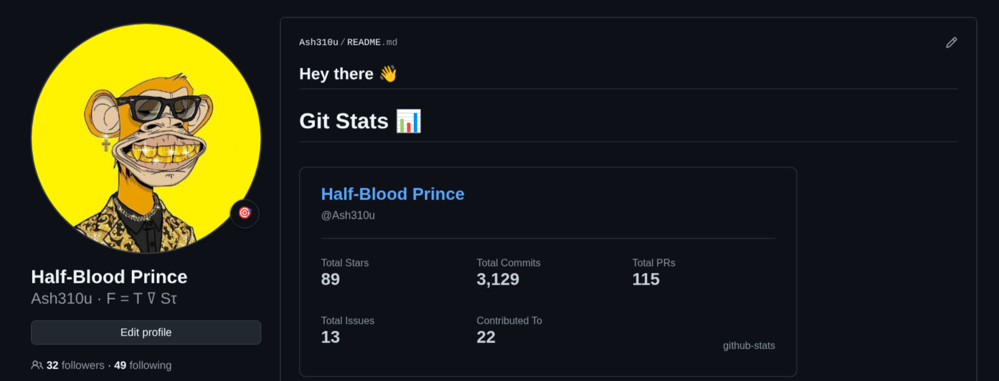

# New GitHub Stats

A small API for generating GitHub stats cards for README profiles, websites, and dashboards.



## Use The API

Use the SVG endpoint directly in Markdown:

```md

```

Use a dark GitHub-style theme:

```md

```

Get raw JSON instead of an SVG card:

```text
https://your-domain.vercel.app/api/stats?username=octocat&format=json
```

Example JSON response:

```json
{
  "username": "octocat",
  "name": "The Octocat",
  "totalStars": 123,
  "totalCommits": 456,
  "totalPullRequests": 78,
  "totalIssues": 9,
  "contributedTo": 12
}
```

## Settings

| Query | Required | Default | Values | Description |
| --- | --- | --- | --- | --- |
| `username` | Yes | none | Any GitHub username | The profile to show stats for. |
| `theme` | No | `github_light` | `github_light`, `github_dark`, `light`, `dark` | Changes the card colors. |
| `format` | No | `svg` | `svg`, `json` | Returns an image card or raw stats data. |

## Stats Shown

- Total stars across the user's public repositories.
- Total commits authored by the user.
- Total pull requests opened by the user.
- Total issues opened by the user.
- Repositories contributed to, counted from returned commit, pull request, and issue search results.

## GitHub Token

`GITHUB_TOKEN` is a GitHub personal access token used by the server when it calls the GitHub API.

The API can run without a token, but GitHub gives unauthenticated requests a much smaller rate limit. If you deploy this for other people to use, add `GITHUB_TOKEN` to your hosting provider's environment variables so the cards do not fail after a small number of requests.

Do not put the token in your README, browser URL, frontend code, or API query params. Keep it only in server environment variables.

For Vercel:

```text
Project Settings -> Environment Variables -> GITHUB_TOKEN
```

For local development, create a `.env` file or run:

```bash
GITHUB_TOKEN=your_token npm start
```

If a real token is ever shared publicly, revoke it in GitHub and create a new one.

## Run Locally

Install dependencies:

```bash
npm install
```

Start the server:

```bash
npm start
```

Start in watch mode:

```bash
npm run dev
```

The server starts on:

```text
http://localhost:3000
```

Try it locally:

```text
http://localhost:3000/api/stats?username=octocat
```

If port `3000` is already busy, use another port:

```bash
PORT=3001 npm run dev
```

## Contributing

Contributions are welcome. You can help by improving card design, adding themes, adding more stat options, improving docs, or fixing API behavior.

Before opening a pull request:

1. Run the project locally.
2. Test the SVG endpoint and JSON endpoint.
3. Keep tokens and local secrets out of commits.
4. Update the README when adding or changing API options.
